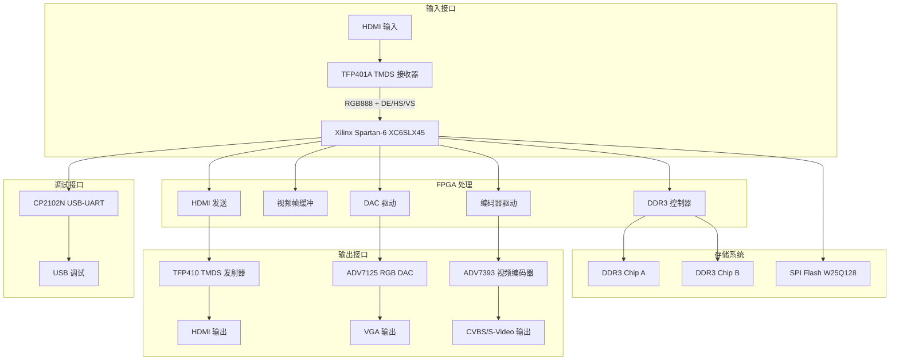
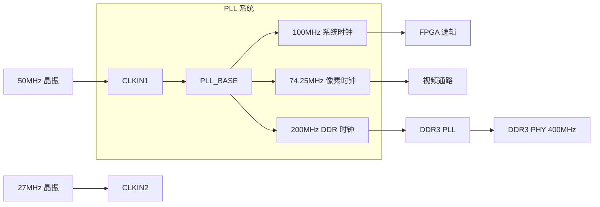

# VIDEO_CONVERTER 系统架构说明

## 1. 系统概述

VIDEO_CONVERTER 是一个基于 FPGA 的视频信号转换和处理平台，支持 HDMI/DVI 信号的接收、处理、存储和输出。

## 2. 系统框图



## 3. 主要芯片规格

### 3.1 FPGA (U8)

| 参数 | 规格 |
|------|------|
| 型号 | XC6SLX45-3FGG484I |
| 系列 | Xilinx Spartan-6 |
| Logic Cells | 43,661 |
| Slice LUTs | 27,288 |
| Block RAM | 2,088 Kbits |
| DSP48A1 | 58 |
| PLL (PLL_BASE) | 4 |
| 全局时钟 | 16 |
| 用户 IO | 373 |
| 封装 | FG484 |
| 速度等级 | -3 (最快) |

### 3.2 DDR3L 内存 (U5, U12)

| 参数 | 规格 |
|------|------|
| 型号 | MT41K256M16TW-107 |
| 厂商 | Micron |
| 容量 | 256Mb (32MB) x2 |
| 位宽 | 16 位 |
| 电压 | 1.5V |
| 速度 | 800MT/s |
| 时序 | CL=6 |
| 刷新 | 4096 cycles/64ms |

### 3.3 HDMI 接收器 (U2)

| 参数 | 规格 |
|------|------|
| 型号 | TFP401APZPR |
| 厂商 | Texas Instruments |
| 接口 | TMDS (DVI/HDMI) |
| 数据速率 | 10-600 Mbps/channel |
| 输出 | 24 位 RGB + DE/HS/VS |
| 封装 | HTQFP-100 |

### 3.4 HDMI 发射器 (U3)

| 参数 | 规格 |
|------|------|
| 型号 | TFP410PAPR |
| 厂商 | Texas Instruments |
| 接口 | TMDS (DVI/HDMI) |
| 数据速率 | 10-600 Mbps/channel |
| 输入 | 24 位 RGB + DE/HS/VS |
| 封装 | HTQFP-64 |

### 3.5 SPI Flash (U123)

| 参数 | 规格 |
|------|------|
| 型号 | W25Q128JVSIQ |
| 厂商 | Winbond |
| 容量 | 128Mbit (16MB) |
| 接口 | SPI/QSPI |
| 电压 | 2.7-3.6V |
| 封装 | SOIC-8 |

## 4. 视频时序规格

### 4.1 支持的视频格式

| 格式 | 分辨率 | 刷新率 | 像素时钟 |
|------|--------|--------|----------|
| VGA | 640x480 | 60Hz | 25.175 MHz |
| SVGA | 800x600 | 60Hz | 40.000 MHz |
| XGA | 1024x768 | 60Hz | 65.000 MHz |
| 720p | 1280x720 | 60Hz | 74.250 MHz |
| 1080p | 1920x1080 | 60Hz | 148.500 MHz |

### 4.2 720p 时序参数 (VESA)

```
水平时序:
  有效像素：1280
  前肩：110
  同步脉冲：40
  后肩：220
  总计：1650 像素

垂直时序:
  有效行：720
  前肩：5
  同步脉冲：5
  后肩：20
  总计：750 行

像素时钟：74.25 MHz
行频：45 kHz
场频：60 Hz
```

## 5. 时钟树架构



## 6. 电源系统

| 电压轨 | 电压 | 电流 (估算) | 用途 |
|--------|------|-------------|------|
| VCCINT | 1.2V | 2.5A | FPGA 内核 |
| VCCAUX | 2.5V | 0.5A | FPGA 辅助 IO |
| VCCO_x | 3.3V | 1.0A | FPGA IO Bank |
| VCCO_y | 2.5V | 0.5A | LVDS IO Bank |
| VDD_DDR | 1.5V | 1.5A | DDR3 内存 |
| VDD3V3 | 3.3V | 2.0A | 系统 3.3V |

## 7. 内存映射

### 7.1 DDR3 地址分配

```
地址范围          大小      用途
0x00000000 - 0x001FFFFF  2MB    帧缓冲 A (视频输入)
0x00200000 - 0x003FFFFF  2MB    帧缓冲 B (视频输出)
0x00400000 - 0x007FFFFF  4MB    通用数据存储
0x00800000 - 0x00FFFFFF  8MB    保留
0x01000000 - 0x01FFFFFF  16MB   保留
```

### 7.2 SPI Flash 地址分配

```
地址范围          大小      用途
0x000000 - 0x03FFFF  256KB  FPGA 配置数据
0x040000 - 0x07FFFF  256KB  系统参数/校准数据
0x080000 - 0xFFFFFF  12MB   用户数据/视频存储
```

## 8. 接口信号定义

### 8.1 HDMI 输入 (TFP401A)

| 信号 | 方向 | 类型 | 说明 |
|------|------|------|------|
| TMDS_RX_D0_P/N | Input | LVDS | 数据通道 0 (蓝色) |
| TMDS_RX_D1_P/N | Input | LVDS | 数据通道 1 (绿色) |
| TMDS_RX_D2_P/N | Input | LVDS | 数据通道 2 (红色) |
| TMDS_RX_CLK_P/N | Input | LVDS | TMDS 时钟 |
| DVI_D[23:0] | Output | LVCMOS25 | 并行 RGB 数据 |
| DE | Output | LVCMOS25 | 数据使能 |
| HS | Output | LVCMOS25 | 行同步 |
| VS | Output | LVCMOS25 | 场同步 |
| PCLK | Output | LVCMOS25 | 像素时钟 |

### 8.2 DDR3 接口

| 信号 | 方向 | 数量 | 说明 |
|------|------|------|------|
| DQ | Inout | 16 | 数据总线 |
| DQS_P/N | Output | 2/2 | 数据选通 (差分) |
| DM | Output | 2 | 数据掩码 |
| ADDR | Output | 14 | 地址总线 |
| BA | Output | 3 | Bank 地址 |
| RAS_N/CAS_N/WE_N | Output | 3 | 控制信号 |
| CK_P/N | Output | 1/1 | 差分时钟 |
| CKE | Output | 1 | 时钟使能 |
| CS_N | Output | 2 | 片选 |
| ODT | Output | 2 | 终端电阻使能 |

## 9. 设计约束

### 9.1 时序约束

```xdc
# 系统时钟
create_clock -period 10.000 [get_ports clk_50mhz]
create_clock -period 13.468 [get_ports pixel_clk]

# DDR3 时钟 (由 MIG 自动生成)
create_clock -period 2.500 [get_pins ddr3_pll/clkout0]

# 输入输出延迟
set_input_delay -clock pixel_clk 2.0 [get_ports tfp401_*]
set_output_delay -clock pixel_clk 2.0 [get_ports tfp410_*]
```

### 9.2 物理约束

- DDR3 走线：等长匹配，差分阻抗 100Ω
- TMDS 走线：差分阻抗 100Ω，长度匹配
- 时钟走线：包地处理，避免跨分割

## 10. 版本历史

| 版本 | 日期 | 作者 | 变更说明 |
|------|------|------|----------|
| 1.0 | 2026-03-16 | FPGA Team | 初始版本 |
