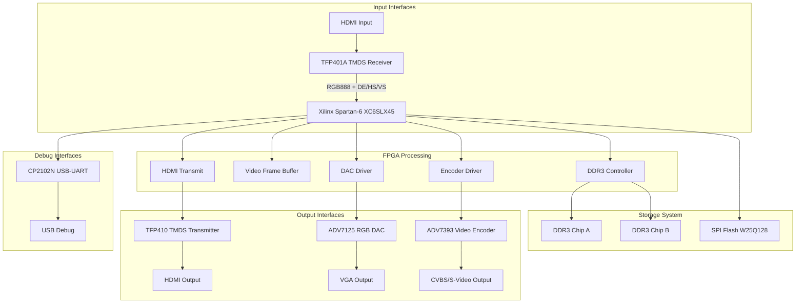
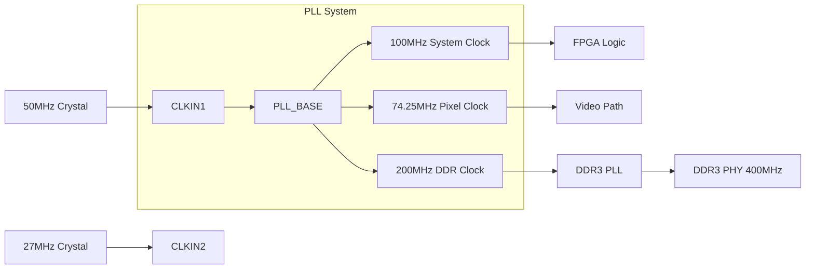

# VIDEO_CONVERTER System Architecture Description

## 1. System Overview

VIDEO_CONVERTER is an FPGA-based video signal conversion and processing platform supporting HDMI/DVI signal reception, processing, storage, and output.

## 2. System Block Diagram



## 3. Main Chip Specifications

### 3.1 FPGA (U8)

| Parameter | Specification |
|------|------|
| Model | XC6SLX45-3FGG484I |
| Series | Xilinx Spartan-6 |
| Logic Cells | 43,661 |
| Slice LUTs | 27,288 |
| Block RAM | 2,088 Kbits |
| DSP48A1 | 58 |
| PLL (PLL_BASE) | 4 |
| Global Clocks | 16 |
| User IO | 373 |
| Package | FG484 |
| Speed Grade | -3 (Fastest) |

### 3.2 DDR3L Memory (U5, U12)

| Parameter | Specification |
|------|------|
| Model | MT41K256M16TW-107 |
| Manufacturer | Micron |
| Capacity | 256Mb (32MB) x2 |
| Width | 16-bit |
| Voltage | 1.5V |
| Speed | 800MT/s |
| Timing | CL=6 |
| Refresh | 4096 cycles/64ms |

### 3.3 HDMI Receiver (U2)

| Parameter | Specification |
|------|------|
| Model | TFP401APZPR |
| Manufacturer | Texas Instruments |
| Interface | TMDS (DVI/HDMI) |
| Data Rate | 10-600 Mbps/channel |
| Output | 24-bit RGB + DE/HS/VS |
| Package | HTQFP-100 |

### 3.4 HDMI Transmitter (U3)

| Parameter | Specification |
|------|------|
| Model | TFP410PAPR |
| Manufacturer | Texas Instruments |
| Interface | TMDS (DVI/HDMI) |
| Data Rate | 10-600 Mbps/channel |
| Input | 24-bit RGB + DE/HS/VS |
| Package | HTQFP-64 |

### 3.5 SPI Flash (U123)

| Parameter | Specification |
|------|------|
| Model | W25Q128JVSIQ |
| Manufacturer | Winbond |
| Capacity | 128Mbit (16MB) |
| Interface | SPI/QSPI |
| Voltage | 2.7-3.6V |
| Package | SOIC-8 |

## 4. Video Timing Specifications

### 4.1 Supported Video Formats

| Format | Resolution | Refresh Rate | Pixel Clock |
|------|--------|--------|----------|
| VGA | 640x480 | 60Hz | 25.175 MHz |
| SVGA | 800x600 | 60Hz | 40.000 MHz |
| XGA | 1024x768 | 60Hz | 65.000 MHz |
| 720p | 1280x720 | 60Hz | 74.250 MHz |
| 1080p | 1920x1080 | 60Hz | 148.500 MHz |

### 4.2 720p Timing Parameters (VESA)

```
Horizontal Timing:
  Active pixels: 1280
  Front porch: 110
  Sync pulse: 40
  Back porch: 220
  Total: 1650 pixels

Vertical Timing:
  Active lines: 720
  Front porch: 5
  Sync pulse: 5
  Back porch: 20
  Total: 750 lines

Pixel Clock: 74.25 MHz
Horizontal Frequency: 45 kHz
Vertical Frequency: 60 Hz
```

## 5. Clock Tree Architecture



## 6. Power System

| Voltage Rail | Voltage | Current (Est.) | Usage |
|--------|------|-------------|------|
| VCCINT | 1.2V | 2.5A | FPGA Core |
| VCCAUX | 2.5V | 0.5A | FPGA Auxiliary IO |
| VCCO_x | 3.3V | 1.0A | FPGA IO Bank |
| VCCO_y | 2.5V | 0.5A | LVDS IO Bank |
| VDD_DDR | 1.5V | 1.5A | DDR3 Memory |
| VDD3V3 | 3.3V | 2.0A | System 3.3V |

## 7. Memory Mapping

### 7.1 DDR3 Address Allocation

```
Address Range       Size    Usage
0x00000000 - 0x001FFFFF  2MB    Frame Buffer A (Video Input)
0x00200000 - 0x003FFFFF  2MB    Frame Buffer B (Video Output)
0x00400000 - 0x007FFFFF  4MB    General Data Storage
0x00800000 - 0x00FFFFFF  8MB    Reserved
0x01000000 - 0x01FFFFFF  16MB   Reserved
```

### 7.2 SPI Flash Address Allocation

```
Address Range       Size    Usage
0x000000 - 0x03FFFF  256KB  FPGA Configuration Data
0x040000 - 0x07FFFF  256KB  System Parameters/Calibration Data
0x080000 - 0xFFFFFF  12MB   User Data/Video Storage
```

## 8. Interface Signal Definitions

### 8.1 HDMI Input (TFP401A)

| Signal | Direction | Type | Description |
|------|------|------|------|
| TMDS_RX_D0_P/N | Input | LVDS | Data Channel 0 (Blue) |
| TMDS_RX_D1_P/N | Input | LVDS | Data Channel 1 (Green) |
| TMDS_RX_D2_P/N | Input | LVDS | Data Channel 2 (Red) |
| TMDS_RX_CLK_P/N | Input | LVDS | TMDS Clock |
| DVI_D[23:0] | Output | LVCMOS25 | Parallel RGB Data |
| DE | Output | LVCMOS25 | Data Enable |
| HS | Output | LVCMOS25 | Horizontal Sync |
| VS | Output | LVCMOS25 | Vertical Sync |
| PCLK | Output | LVCMOS25 | Pixel Clock |

### 8.2 DDR3 Interface

| Signal | Direction | Count | Description |
|------|------|------|------|
| DQ | Inout | 16 | Data Bus |
| DQS_P/N | Output | 2/2 | Data Strobe (Differential) |
| DM | Output | 2 | Data Mask |
| ADDR | Output | 14 | Address Bus |
| BA | Output | 3 | Bank Address |
| RAS_N/CAS_N/WE_N | Output | 3 | Control Signals |
| CK_P/N | Output | 1/1 | Differential Clock |
| CKE | Output | 1 | Clock Enable |
| CS_N | Output | 2 | Chip Select |
| ODT | Output | 2 | On-Die Termination Enable |

## 9. Design Constraints

### 9.1 Timing Constraints

```xdc
# System Clock
create_clock -period 10.000 [get_ports clk_50mhz]
create_clock -period 13.468 [get_ports pixel_clk]

# DDR3 Clock (auto-generated by MIG)
create_clock -period 2.500 [get_pins ddr3_pll/clkout0]

# Input/Output Delay
set_input_delay -clock pixel_clk 2.0 [get_ports tfp401_*]
set_output_delay -clock pixel_clk 2.0 [get_ports tfp410_*]
```

### 9.2 Physical Constraints

- DDR3 traces: Length matching, differential impedance 100Ω
- TMDS traces: Differential impedance 100Ω, length matching
- Clock traces: Ground shielding, avoid crossing splits

## 10. Version History

| Version | Date | Author | Change Description |
|------|------|------|----------|
| 1.0 | 2026-03-16 | FPGA Team | Initial version |
