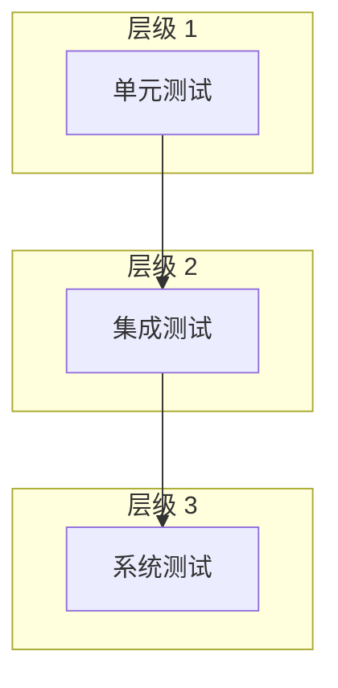

# 验证测试计划

## 1. 测试概述

本文档描述 VIDEO_CONVERTER FPGA 工程的验证测试计划，包括仿真测试和板级测试。

## 2. 测试环境

### 2.1 仿真环境

| 工具 | 版本 | 用途 |
|------|------|------|
| Xilinx ISE | 14.7 | 综合与实现 |
| ModelSim | 10.4+ | 功能仿真 |
| ISim | 14.7 | 快速仿真 |

### 2.2 硬件环境

| 设备 | 用途 |
|------|------|
| VIDEO_CONVERTER 开发板 | 被测目标 |
| HDMI 信号发生器 | 视频输入源 |
| HDMI 显示器 | 视频输出显示 |
| 逻辑分析仪 | 信号抓取 |
| 示波器 | 电源/时钟测量 |
| PC + USB 串口 | 调试通信 |

## 3. 测试层级



## 4. 单元测试

### 4.1 DDR3 控制器测试

**测试目标**: 验证 DDR3 内存读写功能

| 测试项 | 描述 | 预期结果 |
|--------|------|----------|
| UT_DDR3_01 | 初始化序列 | MIG 报告校准完成 |
| UT_DDR3_02 | 单字写入 | 数据正确写入指定地址 |
| UT_DDR3_03 | 单字读取 | 读取数据与写入一致 |
| UT_DDR3_04 | 突发写入 | 连续写入 8 个字 |
| UT_DDR3_05 | 突发读取 | 连续读取 8 个字 |
| UT_DDR3_06 | 地址边界测试 | 首尾地址读写正确 |
| UT_DDR3_07 | 压力测试 | 1000 次读写无错误 |

**测试代码**:
```verilog
task ut_ddr3_write_read;
    input [28:0] addr;
    input [15:0] data;
    reg [15:0] rdata;
    begin
        // 写入
        ddr3_write(addr, data);
        #100;
        // 读取
        ddr3_read(addr, rdata);
        // 验证
        if (rdata !== data) begin
            $display("ERROR: DDR3 read mismatch!");
            $display("  Addr: %h, Expected: %h, Got: %h", addr, data, rdata);
        end else begin
            $display("PASS: DDR3 write/read test");
        end
    end
endtask
```

### 4.2 HDMI 输入测试

**测试目标**: 验证 TFP401A 视频接收功能

| 测试项 | 描述 | 预期结果 |
|--------|------|----------|
| UT_HDMI_IN_01 | 时钟锁定 | PLL 锁定指示为高 |
| UT_HDMI_IN_02 | DE 检测 | DE 信号周期正确 |
| UT_HDMI_IN_03 | 同步检测 | HS/VS 相位正确 |
| UT_HDMI_IN_04 | 数据采样 | RGB 数据正确捕获 |
| UT_HDMI_IN_05 | 分辨率检测 | 640x480/720p/1080p 识别 |

### 4.3 HDMI 输出测试

**测试目标**: 验证 TFP410 视频发送功能

| 测试项 | 描述 | 预期结果 |
|--------|------|----------|
| UT_HDMI_OUT_01 | 像素时钟输出 | 频率正确 |
| UT_HDMI_OUT_02 | 数据输出 | RGB 数据与输入一致 |
| UT_HDMI_OUT_03 | 同步输出 | HS/VS 相位正确 |
| UT_HDMI_OUT_04 | 测试图案 | 彩条/网格图案正确 |

### 4.4 SPI Flash 测试

**测试目标**: 验证 W25Q128 读写功能

| 测试项 | 描述 | 预期结果 |
|--------|------|----------|
| UT_FLASH_01 | 读 ID | 返回正确的器件 ID (EF4018) |
| UT_FLASH_02 | 读状态寄存器 | 返回预期状态 |
| UT_FLASH_03 | 写使能 | 状态寄存器 WEL 置位 |
| UT_FLASH_04 | 页编程 | 256 字节写入正确 |
| UT_FLASH_05 | 扇区擦除 | 4KB 区域清零 |
| UT_FLASH_06 | 数据保持 | 擦除后读写正确 |

### 4.5 UART 测试

**测试目标**: 验证 CP2102N 通信功能

| 测试项 | 描述 | 预期结果 |
|--------|------|----------|
| UT_UART_01 | 发送单字节 | TX 波形正确 |
| UT_UART_02 | 接收单字节 | RX 数据正确 |
| UT_UART_03 | FIFO 测试 | 64 字节收发无溢出 |
| UT_UART_04 | 波特率测试 | 115200bps 无误码 |

## 5. 集成测试

### 5.1 视频通路测试

**测试目标**: 验证 HDMI 输入->DDR3->HDMI 输出通路

| 测试项 | 描述 | 预期结果 |
|--------|------|----------|
| IT_VIDEO_01 | 直通测试 | 输出与输入一致 |
| IT_VIDEO_02 | 帧缓冲测试 | 帧存储/读取正确 |
| IT_VIDEO_03 | 分辨率切换 | 720p/1080p 切换正常 |
| IT_VIDEO_04 | 长时间运行 | 1 小时无错误 |

### 5.2 多模块协同测试

**测试目标**: 验证多模块同时工作

| 测试项 | 描述 | 预期结果 |
|--------|------|----------|
| IT_MULTI_01 | 视频 +DDR3 | 视频流 + 内存访问 |
| IT_MULTI_02 | 视频 +UART | 视频流 + 调试输出 |
| IT_MULTI_03 | 全功能 | 所有模块同时工作 |

## 6. 系统测试

### 6.1 功能测试

| 测试项 | 描述 | 预期结果 |
|--------|------|----------|
| ST_FUNC_01 | 上电自检 | LED 指示正常 |
| ST_FUNC_02 | HDMI 输入显示 | 显示器正常显示 |
| ST_FUNC_03 | 按键响应 | 按键切换模式正常 |
| ST_FUNC_04 | UART 命令 | 串口命令响应正确 |

### 6.2 性能测试

| 测试项 | 描述 | 指标 |
|--------|------|------|
| ST_PERF_01 | 视频带宽 | >500MB/s |
| ST_PERF_02 | DDR3 带宽 | >3GB/s |
| ST_PERF_03 | 系统功耗 | <5W |
| ST_PERF_04 | 工作温度 | <70°C |

### 6.3 稳定性测试

| 测试项 | 描述 | 时长 |
|--------|------|------|
| ST_STAB_01 | 连续运行 | 24 小时 |
| ST_STAB_02 | 温度循环 | -10°C~+60°C |
| ST_STAB_03 | 电源波动 | ±10% |

## 7. 测试检查清单

### 7.1 综合前检查

- [ ] 所有模块语法检查通过
- [ ] 时钟/复位连接正确
- [ ] 未驱动信号已处理
- [ ] 时序约束完整

### 7.2 实现前检查

- [ ] 综合无时序违例
- [ ] UCF 约束完整
- [ ] 引脚分配正确
- [ ] 资源使用合理

### 7.3 板级测试前检查

- [ ] 比特流生成成功
- [ ] 电源检查正常
- [ ] 时钟频率正确
- [ ] 复位逻辑正常

## 8. 问题跟踪

### 8.1 问题记录模板

```
问题 ID: BUG_XXX
发现日期：2026-XX-XX
严重等级：Critical/Major/Minor
问题描述：
复现步骤：
影响范围：
根本原因：
解决方案：
验证结果：
```

### 8.2 已知问题

| ID | 描述 | 状态 | 备注 |
|----|------|------|------|
| - | - | - | - |

## 9. 测试报告

### 9.1 测试结果汇总

| 测试类别 | 总数 | 通过 | 失败 | 通过率 |
|----------|------|------|------|--------|
| 单元测试 | 25 | - | - | -% |
| 集成测试 | 10 | - | - | -% |
| 系统测试 | 15 | - | - | -% |
| **总计** | **50** | **-** | **-** | **-%** |

### 9.2 测试结论

```
测试状态：进行中/已完成
结论：通过/有条件通过/不通过
建议：
```

## 10. 版本历史

| 版本 | 日期 | 作者 | 变更说明 |
|------|------|------|----------|
| 1.0 | 2026-03-16 | FPGA Team | 初始版本 |
