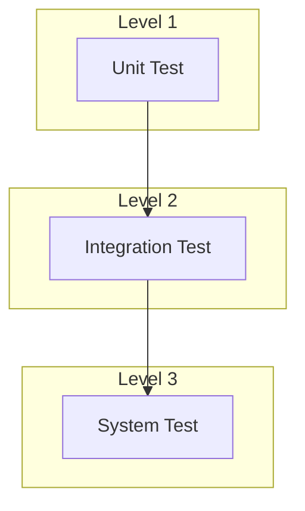

# Verification Test Plan

## 1. Test Overview

This document describes the verification test plan for the VIDEO_CONVERTER FPGA project, including simulation tests and board-level tests.

## 2. Test Environment

### 2.1 Simulation Environment

| Tool | Version | Usage |
|------|------|------|
| Xilinx ISE | 14.7 | Synthesis and Implementation |
| ModelSim | 10.4+ | Functional Simulation |
| ISim | 14.7 | Quick Simulation |

### 2.2 Hardware Environment

| Equipment | Usage |
|------|------|
| VIDEO_CONVERTER Development Board | Test Target |
| HDMI Signal Generator | Video Input Source |
| HDMI Display | Video Output Display |
| Logic Analyzer | Signal Capture |
| Oscilloscope | Power/Clock Measurement |
| PC + USB Serial | Debug Communication |

## 3. Test Levels



## 4. Unit Tests

### 4.1 DDR3 Controller Test

**Test Objective**: Verify DDR3 memory read/write functionality

| Test Item | Description | Expected Result |
|--------|------|----------|
| UT_DDR3_01 | Initialization Sequence | MIG reports calibration complete |
| UT_DDR3_02 | Single Word Write | Data correctly written to specified address |
| UT_DDR3_03 | Single Word Read | Read data matches written data |
| UT_DDR3_04 | Burst Write |连续 write 8 words |
| UT_DDR3_05 | Burst Read |连续 read 8 words |
| UT_DDR3_06 | Address Boundary Test | First/last address read/write correct |
| UT_DDR3_07 | Stress Test | 1000 read/write operations without errors |

**Test Code**:
```verilog
task ut_ddr3_write_read;
    input [28:0] addr;
    input [15:0] data;
    reg [15:0] rdata;
    begin
        // Write
        ddr3_write(addr, data);
        #100;
        // Read
        ddr3_read(addr, rdata);
        // Verify
        if (rdata !== data) begin
            $display("ERROR: DDR3 read mismatch!");
            $display("  Addr: %h, Expected: %h, Got: %h", addr, data, rdata);
        end else begin
            $display("PASS: DDR3 write/read test");
        end
    end
endtask
```

### 4.2 HDMI Input Test

**Test Objective**: Verify TFP401A video reception functionality

| Test Item | Description | Expected Result |
|--------|------|----------|
| UT_HDMI_IN_01 | Clock Lock | PLL lock indicator is high |
| UT_HDMI_IN_02 | DE Detection | DE signal period is correct |
| UT_HDMI_IN_03 | Sync Detection | HS/VS phase is correct |
| UT_HDMI_IN_04 | Data Sampling | RGB data correctly captured |
| UT_HDMI_IN_05 | Resolution Detection | 640x480/720p/1080p recognized |

### 4.3 HDMI Output Test

**Test Objective**: Verify TFP410 video transmission functionality

| Test Item | Description | Expected Result |
|--------|------|----------|
| UT_HDMI_OUT_01 | Pixel Clock Output | Frequency is correct |
| UT_HDMI_OUT_02 | Data Output | RGB data matches input |
| UT_HDMI_OUT_03 | Sync Output | HS/VS phase is correct |
| UT_HDMI_OUT_04 | Test Pattern | Color bar/grid pattern is correct |

### 4.4 SPI Flash Test

**Test Objective**: Verify W25Q128 read/write functionality

| Test Item | Description | Expected Result |
|--------|------|----------|
| UT_FLASH_01 | Read ID | Return correct device ID (EF4018) |
| UT_FLASH_02 | Read Status Register | Return expected status |
| UT_FLASH_03 | Write Enable | Status register WEL set |
| UT_FLASH_04 | Page Program | 256-byte write is correct |
| UT_FLASH_05 | Sector Erase | 4KB area cleared |
| UT_FLASH_06 | Data Retention | Read/write correct after erase |

### 4.5 UART Test

**Test Objective**: Verify CP2102N communication functionality

| Test Item | Description | Expected Result |
|--------|------|----------|
| UT_UART_01 | Transmit Single Byte | TX waveform is correct |
| UT_UART_02 | Receive Single Byte | RX data is correct |
| UT_UART_03 | FIFO Test | 64-byte transmit/receive without overflow |
| UT_UART_04 | Baud Rate Test | 115200bps without errors |

## 5. Integration Tests

### 5.1 Video Path Test

**Test Objective**: Verify HDMI Input→DDR3→HDMI Output path

| Test Item | Description | Expected Result |
|--------|------|----------|
| IT_VIDEO_01 | Passthrough Test | Output matches input |
| IT_VIDEO_02 | Frame Buffer Test | Frame store/read is correct |
| IT_VIDEO_03 | Resolution Switch | 720p/1080p switch is normal |
| IT_VIDEO_04 | Long-term Run | No errors in 1 hour |

### 5.2 Multi-Module Coordination Test

**Test Objective**: Verify multiple modules working simultaneously

| Test Item | Description | Expected Result |
|--------|------|----------|
| IT_MULTI_01 | Video + DDR3 | Video stream + memory access |
| IT_MULTI_02 | Video + UART | Video stream + debug output |
| IT_MULTI_03 | Full Function | All modules working simultaneously |

## 6. System Tests

### 6.1 Functional Tests

| Test Item | Description | Expected Result |
|--------|------|----------|
| ST_FUNC_01 | Power-on Self-test | LED indication is normal |
| ST_FUNC_02 | HDMI Input Display | Display shows normally |
| ST_FUNC_03 | Button Response | Button mode switch is normal |
| ST_FUNC_04 | UART Command | Serial command response is correct |

### 6.2 Performance Tests

| Test Item | Description | Metric |
|--------|------|------|
| ST_PERF_01 | Video Bandwidth | >500MB/s |
| ST_PERF_02 | DDR3 Bandwidth | >3GB/s |
| ST_PERF_03 | System Power | <5W |
| ST_PERF_04 | Operating Temperature | <70°C |

### 6.3 Stability Tests

| Test Item | Description | Duration |
|--------|------|------|
| ST_STAB_01 | Continuous Operation | 24 hours |
| ST_STAB_02 | Temperature Cycle | -10°C~+60°C |
| ST_STAB_03 | Power Fluctuation | ±10% |

## 7. Test Checklist

### 7.1 Pre-Synthesis Check

- [ ] All module syntax checks passed
- [ ] Clock/reset connections are correct
- [ ] Undriven signals are handled
- [ ] Timing constraints are complete

### 7.2 Pre-Implementation Check

- [ ] No timing violations in synthesis
- [ ] UCF constraints are complete
- [ ] Pin assignment is correct
- [ ] Resource usage is reasonable

### 7.3 Pre-Board Test Check

- [ ] Bitstream generation successful
- [ ] Power check is normal
- [ ] Clock frequency is correct
- [ ] Reset logic is normal

## 8. Issue Tracking

### 8.1 Issue Record Template

```
Issue ID: BUG_XXX
Discovery Date: 2026-XX-XX
Severity: Critical/Major/Minor
Issue Description:
Reproduction Steps:
Impact Scope:
Root Cause:
Solution:
Verification Result:
```

### 8.2 Known Issues

| ID | Description | Status | Remarks |
|----|------|------|------|
| - | - | - | - |

## 9. Test Report

### 9.1 Test Results Summary

| Test Category | Total | Pass | Fail | Pass Rate |
|----------|------|------|------|--------|
| Unit Test | 25 | - | - | -% |
| Integration Test | 10 | - | - | -% |
| System Test | 15 | - | - | -% |
| **Total** | **50** | **-** | **-** | **-%** |

### 9.2 Test Conclusion

```
Test Status: In Progress/Complete
Conclusion: Pass/Conditional Pass/Fail
Recommendations:
```

## 10. Version History

| Version | Date | Author | Change Description |
|------|------|------|----------|
| 1.0 | 2026-03-16 | FPGA Team | Initial version |
